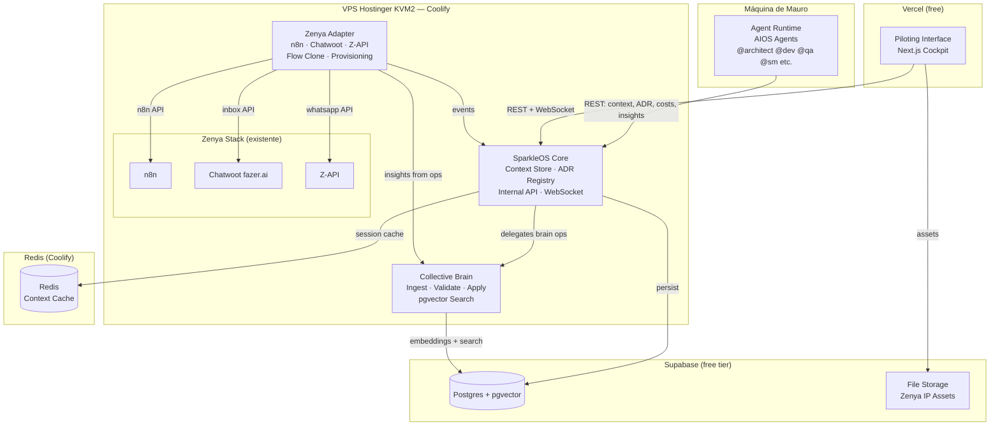
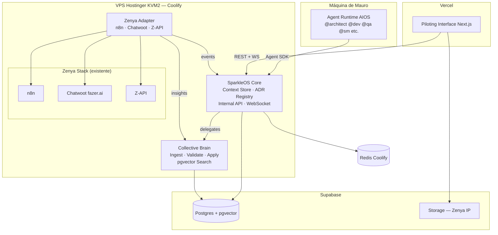
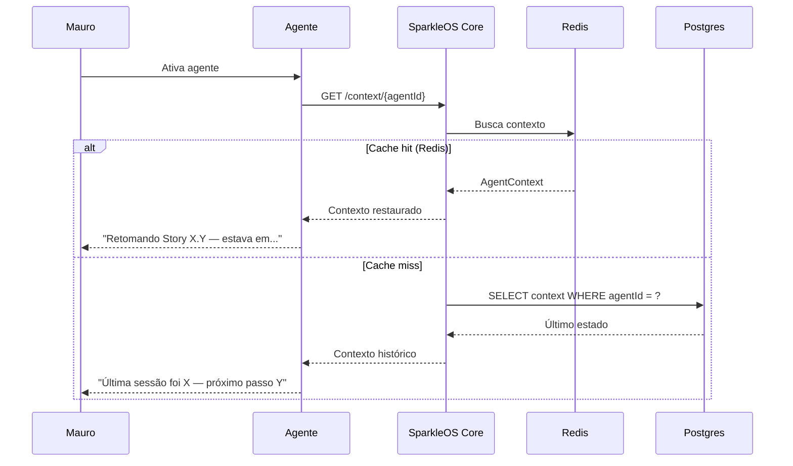
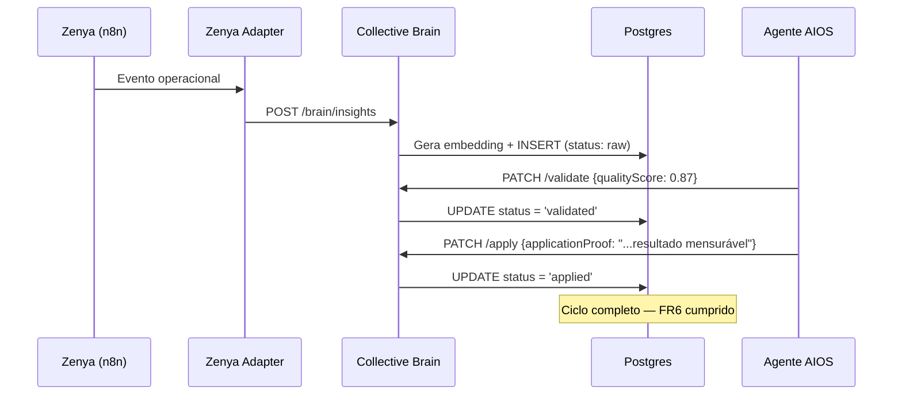
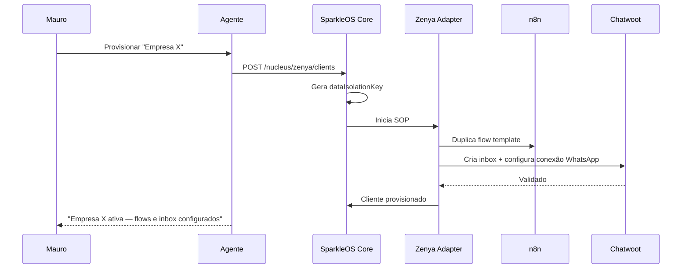
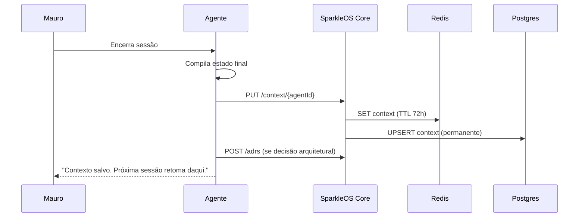

# SparkleOS Fullstack Architecture Document

**Versão:** 1.0
**Data:** 2026-04-11
**Autor:** Aria (@architect)
**Status:** Aprovado — pronto para @sm criar stories do Epic 1
**Derivado de:** `docs/prd.md` + `docs/brief.md`

---

## Change Log

| Date | Version | Description | Author |
|------|---------|-------------|--------|
| 2026-04-11 | 1.0 | Versão inicial — sessão interativa com Mauro | Aria (@architect) |

---

## 1. Introduction

O SparkleOS é um sistema operacional AI-native onde agentes AIOS são os atores primários — não usuários humanos. Este documento unifica arquitetura de backend e frontend em um único artefato de verdade, servindo como referência para todo o desenvolvimento.

### O que "AI-native" significa aqui

| Dimensão | Sistema Tradicional com IA | SparkleOS AI-Native |
|----------|---------------------------|---------------------|
| **Quem constrói** | Humanos usam IA como ferramenta | Agentes IA constroem o próprio sistema |
| **Memória** | Stateless por sessão | Contexto persiste entre sessões (FR11) |
| **Decisões** | Humano revisa cada decisão | Agente age autonomamente dentro de critérios |
| **Aprendizado** | Modelo base fixo | Ciclo contínuo: operação → insight → aplicação |
| **Rastreabilidade** | Logs técnicos | Cada ação rastreada a story AIOS (FR14) |
| **Estrutura** | Módulos por funcionalidade | Órgãos → Núcleos → inputs/outputs/SOP |

### Implicações arquiteturais

1. **Context Store é cidadão de primeira classe** — não detalhe de implementação
2. **O sistema é seu próprio cliente** — API otimizada para ser consumida por IAs
3. **Observabilidade ≠ Logs** — Piloting Interface traduz atividade técnica em narrativa operacional
4. **Dados têm semântica** — Collective Brain extrai, valida e aplica conhecimento
5. **Multi-tenant by design** — cada cliente Zenya isolado desde o primeiro byte

### Starter Template

N/A — Projeto greenfield. Stack definida pelos agentes conforme necessidade do sistema, sem restrições (FR9, NFR6).

---

## 2. High Level Architecture

### 2.1 Technical Summary

SparkleOS é construído em três camadas distintas: (1) **Infrastructure Layer** — habitat dos agentes, com Context Store, ADR Registry e Internal API; (2) **Brain Layer** — Collective Brain com ingestão multi-fonte, validação de qualidade e aplicação mensurável; (3) **Piloting Interface** — cockpit de Mauro que traduz atividade técnica em narrativa operacional. A integração Zenya (n8n + Chatwoot fazer.ai + Z-API) é encapsulada em Zenya Adapter como camada isolada de curto prazo. Todo o backend roda na VPS Hostinger KVM2 existente via Coolify, sem custo adicional de infraestrutura.

### 2.2 Platform and Infrastructure

**Decisão: VPS Hostinger KVM2 (existente) + Coolify + Vercel + Supabase**

| Componente | Plataforma | Custo |
|-----------|-----------|-------|
| SparkleOS Core + Brain | VPS Hostinger KVM2 via Coolify | $0 (já pago) |
| Piloting Interface | Vercel free tier | $0 |
| Postgres + pgvector | Supabase free tier | $0 |
| Redis | Coolify na VPS | $0 |
| **Total adicional** | | **$0** |

**Specs da VPS:** 2 vCPU, 8GB RAM, 100GB disco, Ubuntu 24.04, Coolify instalado, Brazil-Campinas.

**Rationale:** A VPS já hospeda a Zenya (n8n + Chatwoot + Z-API) e tem ~5-6GB RAM disponível após o stack existente. Coolify já está instalado — é um Railway/Render self-hosted gratuito. Vercel é a melhor plataforma para Next.js. Supabase oferece Postgres + pgvector no free tier — elimina necessidade de serviço vetorial separado.

### 2.3 Repository Structure

**Monorepo com pnpm workspaces** — leve, sem overhead de Nx/Turborepo para o estágio atual.

**Rationale:** Múltiplos domínios que precisam coexistir mas compartilhar tipos e contratos. `organs/` como diretório de primeiro nível reflete a arquitetura conceitual diretamente no repositório.

### 2.4 Architecture Diagram



### 2.5 Architectural Patterns

- **Event-Driven Core:** Agentes publicam eventos; sistema reage de forma desacoplada — _Rationale:_ Órgãos crescem independentemente sem acoplamento ao core
- **Adapter Pattern (Zenya):** n8n + Chatwoot + Z-API encapsulados em adapter isolado — _Rationale:_ Migração gradual sem impacto no resto do sistema
- **Repository Pattern:** Acesso a dados abstraído por domínio — _Rationale:_ Testabilidade e futura troca de DB sem refatoração
- **Context Store Pattern:** Estado persistente por agente/sessão como cidadão de primeira classe — _Rationale:_ FR11 é requisito crítico — contexto não pode ser ad hoc
- **Multi-tenant Isolation:** Row-Level Security no Postgres por cliente desde o design — _Rationale:_ NFR3 é não-negociável — implementado no schema, não na aplicação
- **Knowledge Pipeline:** Ingestão → Validação → Aplicação como pipeline separado — _Rationale:_ Collective Brain tem requisitos distintos de dados operacionais

---

## 3. Tech Stack

| Categoria | Tecnologia | Versão | Propósito | Rationale |
|-----------|-----------|--------|-----------|-----------|
| Frontend Language | TypeScript | 5.x | Tipagem em toda a stack | Type safety compartilhado — um tipo definido uma vez |
| Frontend Framework | Next.js | 15 (App Router) | Piloting Interface | Server Components para dados em tempo real |
| UI Library | shadcn/ui + Radix | latest | Componentes do cockpit | Headless, sem vendor lock, altamente customizável |
| State Management | TanStack Query | v5 | Dados do servidor | Cache, refetch automático, sem Redux |
| CSS Framework | Tailwind CSS | v4 | Estilização | Compatível com shadcn, utility-first |
| Backend Language | TypeScript (Node.js) | Node 22 LTS | Core + Brain | Mesma linguagem do frontend — tipos compartilhados |
| Backend Framework | Hono | v4 | Internal API | Ultra-leve, otimizado para consumo por agentes |
| API Style | REST + WebSocket | — | REST + real-time cockpit | WS para atividade em tempo real |
| Database | Postgres 16 | via Supabase | Dados estruturados + vetorial | Relacional + pgvector no mesmo serviço |
| Vector Store | pgvector | built-in | Embeddings do Collective Brain | Sem serviço adicional para v1 |
| Cache | Redis | 7.x via Coolify | Context cache dos agentes | < 5ms para recuperação de contexto |
| File Storage | Supabase Storage | — | IP assets da Zenya | Versionado, acessível via API |
| Auth | IP allowlist + token interno | — | Acesso único (Mauro) | Sistema interno — sem OAuth necessário |
| AI/LLM SDK | Anthropic SDK (TypeScript) | latest | Claude API + embeddings (Voyage) | Já pago ($550/mês), SDK oficial |
| Frontend Testing | Vitest + Testing Library | latest | Testes de componentes | Rápido, TS-native |
| Backend Testing | Vitest | latest | Testes de serviços | Ferramenta única |
| E2E Testing | Playwright | latest | Validação cockpit | Já no MCP stack do AIOS |
| Monorepo Tool | pnpm workspaces | 9.x | Gerenciamento do monorepo | Leve, sem Nx overhead |
| Build/Deploy | Coolify | self-hosted | Deploy backend | Já instalado na VPS |
| CI/CD | GitHub Actions | — | Pipeline de qualidade | Free tier, webhook com Coolify |
| Monitoring | Better Stack | free tier | Uptime + logs | Free tier cobre todos os serviços |
| Logging | Pino | latest | Logs JSON estruturados | Logger mais rápido do Node.js |

---

## 4. Data Models

### AgentContext (FR11 — Persistência de Contexto)

**Propósito:** Preservar estado de trabalho de cada agente entre sessões.

```typescript
interface AgentContext {
  id: string;
  agentId: string;          // 'dev', 'architect', 'pm', etc.
  sessionId: string;
  storyId: string | null;
  workState: {
    currentTask: string;
    filesModified: string[];
    nextAction: string;
    blockers: string[];
  };
  decisionLog: Array<{
    decision: string;
    rationale: string;
    alternatives?: string[];
    timestamp: string;
  }>;
  createdAt: string;
  updatedAt: string;
}
```

**Relacionamentos:** Pertence a AgentSession; referencia zero ou uma Story.

---

### ADR (FR12 — Registro de Decisões Arquiteturais)

**Propósito:** Toda decisão arquitetural registrada formalmente — consultável por qualquer agente em sessões futuras.

```typescript
interface ADR {
  id: string;               // "ADR-001"
  title: string;
  status: 'proposed' | 'accepted' | 'deprecated' | 'superseded';
  date: string;
  authors: string[];
  context: string;
  decision: string;
  rationale: string;
  alternatives: Array<{ option: string; reason_rejected: string }>;
  consequences: { positive: string[]; negative: string[] };
  supersededBy: string | null;
  tags: string[];
}
```

**Relacionamentos:** Armazenado como `docs/adrs/ADR-{id}.md` + indexado no Postgres.

---

### Insight (FR5, FR6, FR15 — Collective Brain)

**Propósito:** Unidade de conhecimento capturada de qualquer fonte. Passa por validação antes de ser aplicado.

```typescript
interface Insight {
  id: string;
  source: 'zenya_operation' | 'agent_research' | 'mauro_input';
  nucleusId: string | null;
  content: string;
  embedding: number[];      // pgvector 1024 dims (Voyage-3 — corrigido em ADR-005)
  status: 'raw' | 'validated' | 'applied' | 'rejected';
  qualityScore: number | null;
  validationNotes: string | null;
  applicationProof: string | null;  // FR6: aplicação mensurável obrigatória
  tags: string[];
  createdAt: string;
  updatedAt: string;
}
```

---

### ZenyaClient (NFR3 — Isolamento Multi-tenant)

**Propósito:** Âncora do isolamento — todos os dados de um cliente associados a este registro.

```typescript
interface ZenyaClient {
  id: string;
  externalId: string;           // Chatwoot inbox ID
  name: string;
  whatsappNumber: string;
  n8nWorkflowIds: string[];
  chatwootInboxId: number;
  status: 'active' | 'paused' | 'offboarded';
  dataIsolationKey: string;     // chave usada no RLS
  provisionedAt: string;
  provisionedBy: string;
  metadata: Record<string, unknown>;
}
```

---

### CostEvent (NFR4 — Rastreamento de Custo)

**Propósito:** Cada operação com custo registrada individualmente. Nunca deletado.

```typescript
interface CostEvent {
  id: string;
  agentId: string;
  operationType: 'llm_call' | 'web_search' | 'embedding' | 'n8n_execution' | 'other';
  model: string | null;
  inputTokens: number | null;
  outputTokens: number | null;
  costUsd: number;
  storyId: string | null;       // FR14: rastreabilidade
  sessionId: string;
  nucleusId: string | null;
  timestamp: string;
}
```

---

## 5. API Specification

API interna REST — consumida primariamente por agentes AIOS e pelo cockpit. Autenticação: `X-Agent-Token`.

```yaml
openapi: 3.0.0
info:
  title: SparkleOS Internal API
  version: 1.0.0
servers:
  - url: https://core.srv1360907.hstgr.cloud/api/v1

paths:
  # CONTEXT STORE — FR11
  /context/{agentId}:
    get:
      summary: Recuperar contexto do agente (Redis first, fallback Postgres)
    put:
      summary: Salvar contexto (Redis TTL 72h + Postgres permanente)

  /context/{agentId}/decisions:
    post:
      summary: Append-only ao decision log

  # ADR REGISTRY — FR12
  /adrs:
    get:
      summary: Listar ADRs (filtro por status, tags)
    post:
      summary: Criar ADR (cria .md em docs/adrs/ + indexa Postgres)

  /adrs/{id}:
    get:
      summary: ADR completa

  # COLLECTIVE BRAIN — FR5, FR6, FR15
  /brain/insights:
    post:
      summary: Ingerir insight (qualquer fonte, gera embedding automaticamente)

  /brain/insights/search:
    post:
      summary: Busca semântica (só validated/applied, threshold 0.75)

  /brain/insights/{id}/validate:
    patch:
      summary: Validar insight (raw → validated)

  /brain/insights/{id}/apply:
    patch:
      summary: Registrar aplicação mensurável (FR6 — ciclo completo)

  # ZENYA NUCLEUS — FR3, FR4, FR13
  /nucleus/zenya/flows:
    get:
      summary: Inventário dos ~15 flows n8n

  /nucleus/zenya/flows/{flowId}/clone:
    post:
      summary: Clonar flow para cliente ou teste (FR4)

  /nucleus/zenya/clients:
    get:
      summary: Listar clientes Zenya
    post:
      summary: Provisionar novo cliente — executa SOP formal (FR13, assíncrono)

  # COST TRACKING — NFR4
  /costs/events:
    post:
      summary: Registrar evento de custo (chamado automaticamente pelo middleware)

  /costs/summary:
    get:
      summary: Resumo agregado por agente e período (daily/weekly/monthly)

  # HEALTH — NFR8
  /health:
    get:
      summary: Status Redis + Postgres (monitorado pelo Coolify e Better Stack)
```

---

## 6. Components

### SparkleOS Core
**Responsabilidade:** Núcleo do sistema. Context Store, ADR Registry, Internal API, WebSocket.
**Stack:** Node.js 22 + Hono + Redis + Postgres — Coolify na VPS
**Hub único:** Todos os componentes passam por ele — ponto único de auth e cost tracking.

### Collective Brain
**Responsabilidade:** Pipeline de conhecimento — ingestão → validação → aplicação → busca semântica.
**Stack:** Node.js 22 + Hono + pgvector — Coolify na VPS
**Separado do Core:** Requisitos distintos (embeddings, vetorial, ML pipeline) — separação evita acoplar complexidade ao core operacional.

### Zenya Adapter
**Responsabilidade:** Integração com n8n + Chatwoot fazer.ai + Z-API. Encapsula toda complexidade — o resto do sistema não conhece n8n diretamente.
**Stack:** Node.js 22 + Hono — Coolify na VPS
**Nota:** Chatwoot fazer.ai já abstrai o provider WhatsApp (Z-API / Baileys / API oficial). Migração para API oficial Meta = mudança de configuração de inbox, não reengenharia.

### Piloting Interface
**Responsabilidade:** Cockpit de Mauro. Traduz atividade técnica em narrativa operacional.
**Stack:** Next.js 15 + shadcn/ui + TanStack Query — Vercel free tier
**UI v1 = funcional, não polida.** Refinamento visual é escopo de epic dedicado pós-Epic 4.

### Agent Runtime (AIOS)
**Responsabilidade:** Agentes AIOS operando dentro do SparkleOS. Consome Internal API via Agent SDK.
**Localização:** Máquina de Mauro (Claude Code) — não deployado na VPS durante fase de construção.
**Nota:** Worker agents para operação autônoma são criados PELO AIOS em épicos futuros — distintos dos AIOS builders.

### Component Diagram



---

## 7. External APIs

| API | Propósito | Base URL | Auth |
|-----|-----------|----------|------|
| Anthropic Claude | LLM + embeddings Voyage | `https://api.anthropic.com/v1` | API Key |
| n8n (self-hosted) | Gestão de flows Zenya | `http://localhost:5678/api/v1` | API Key |
| Chatwoot fazer.ai | Inboxes + conversas | `https://[instancia].fazer.ai/api/v1` | User Token |
| Z-API | Bridge WhatsApp (via Chatwoot) | Gerenciado pelo Chatwoot | Token por instância |
| EXA (Docker MCP) | Web search para agentes | `mcp__docker-gateway__web_search_exa` | API Key Docker |
| Context7 (Docker MCP) | Documentação de bibliotecas | `mcp__docker-gateway__resolve-library-id` | — |
| Supabase | Postgres + pgvector + Storage | `https://[project].supabase.co` | Service Role Key |

**Nota Z-API:** Usado via Chatwoot fazer.ai como método de conexão — não acessado diretamente. Migração para API oficial Meta = mudança de configuração de inbox no Chatwoot. ADR-004 documenta a decisão e o gatilho de migração.

**Nota n8n + Chatwoot:** Acessados via `localhost` (mesma VPS) — zero latência de rede, zero custo de egress.

---

## 8. Core Workflows

### Workflow 1: Início de Sessão — Context Recovery (FR11)



### Workflow 2: Insight → Collective Brain (FR5, FR6)



### Workflow 3: Provisionamento de Cliente Zenya (FR13)



### Workflow 4: Fim de Sessão — Persistência



---

## 9. Database Schema

```sql
CREATE EXTENSION IF NOT EXISTS "uuid-ossp";
CREATE EXTENSION IF NOT EXISTS "vector";

-- CONTEXT STORE — FR11
CREATE TABLE agent_contexts (
  id            UUID PRIMARY KEY DEFAULT uuid_generate_v4(),
  agent_id      TEXT NOT NULL,
  session_id    TEXT NOT NULL,
  story_id      TEXT,
  work_state    JSONB NOT NULL DEFAULT '{}',
  decision_log  JSONB NOT NULL DEFAULT '[]',
  created_at    TIMESTAMPTZ NOT NULL DEFAULT NOW(),
  updated_at    TIMESTAMPTZ NOT NULL DEFAULT NOW()
);
CREATE INDEX idx_agent_contexts_latest ON agent_contexts(agent_id, updated_at DESC);

-- ADR REGISTRY — FR12
CREATE TABLE adrs (
  id              TEXT PRIMARY KEY,
  title           TEXT NOT NULL,
  status          TEXT NOT NULL DEFAULT 'proposed'
                  CHECK (status IN ('proposed','accepted','deprecated','superseded')),
  file_path       TEXT NOT NULL,
  context         TEXT NOT NULL,
  decision        TEXT NOT NULL,
  rationale       TEXT NOT NULL,
  alternatives    JSONB NOT NULL DEFAULT '[]',
  consequences    JSONB NOT NULL DEFAULT '{"positive":[],"negative":[]}',
  superseded_by   TEXT REFERENCES adrs(id),
  tags            TEXT[] NOT NULL DEFAULT '{}',
  authors         TEXT[] NOT NULL DEFAULT '{}',
  created_at      TIMESTAMPTZ NOT NULL DEFAULT NOW()
);
CREATE INDEX idx_adrs_tags ON adrs USING GIN(tags);

-- COLLECTIVE BRAIN — FR5, FR6, FR15
CREATE TABLE insights (
  id                UUID PRIMARY KEY DEFAULT uuid_generate_v4(),
  source            TEXT NOT NULL
                    CHECK (source IN ('zenya_operation','agent_research','mauro_input')),
  nucleus_id        TEXT,
  content           TEXT NOT NULL,
  embedding         vector(1536),
  status            TEXT NOT NULL DEFAULT 'raw'
                    CHECK (status IN ('raw','validated','applied','rejected')),
  quality_score     NUMERIC(3,2),
  validation_notes  TEXT,
  application_proof TEXT,
  tags              TEXT[] NOT NULL DEFAULT '{}',
  created_at        TIMESTAMPTZ NOT NULL DEFAULT NOW(),
  updated_at        TIMESTAMPTZ NOT NULL DEFAULT NOW()
);
CREATE INDEX idx_insights_embedding ON insights
  USING hnsw (embedding vector_cosine_ops)
  WITH (m = 16, ef_construction = 64);
CREATE INDEX idx_insights_status ON insights(status);

-- ZENYA CLIENTS — NFR3
CREATE TABLE zenya_clients (
  id                   UUID PRIMARY KEY DEFAULT uuid_generate_v4(),
  external_id          TEXT UNIQUE,
  name                 TEXT NOT NULL,
  whatsapp_number      TEXT NOT NULL,
  n8n_workflow_ids     TEXT[] NOT NULL DEFAULT '{}',
  chatwoot_inbox_id    INTEGER,
  status               TEXT NOT NULL DEFAULT 'active'
                       CHECK (status IN ('active','paused','offboarded')),
  data_isolation_key   TEXT NOT NULL UNIQUE DEFAULT uuid_generate_v4()::TEXT,
  provisioned_at       TIMESTAMPTZ NOT NULL DEFAULT NOW(),
  provisioned_by       TEXT NOT NULL,
  metadata             JSONB NOT NULL DEFAULT '{}'
);

-- ROW LEVEL SECURITY — NFR3
CREATE TABLE zenya_conversations (
  id                 UUID PRIMARY KEY DEFAULT uuid_generate_v4(),
  client_id          UUID NOT NULL REFERENCES zenya_clients(id),
  isolation_key      TEXT NOT NULL,
  chatwoot_conv_id   INTEGER,
  content            JSONB NOT NULL DEFAULT '{}',
  created_at         TIMESTAMPTZ NOT NULL DEFAULT NOW()
);
ALTER TABLE zenya_conversations ENABLE ROW LEVEL SECURITY;
CREATE POLICY zenya_client_isolation ON zenya_conversations
  USING (isolation_key = current_setting('app.current_client_key', TRUE));

-- COST TRACKING — NFR4
CREATE TABLE cost_events (
  id              UUID PRIMARY KEY DEFAULT uuid_generate_v4(),
  agent_id        TEXT NOT NULL,
  operation_type  TEXT NOT NULL
                  CHECK (operation_type IN (
                    'llm_call','web_search','embedding','n8n_execution','storage_op','other'
                  )),
  model           TEXT,
  input_tokens    INTEGER,
  output_tokens   INTEGER,
  cost_usd        NUMERIC(10,6) NOT NULL,
  story_id        TEXT,
  session_id      TEXT NOT NULL,
  nucleus_id      TEXT,
  created_at      TIMESTAMPTZ NOT NULL DEFAULT NOW()
  -- NUNCA deletar — audit trail permanente
);
CREATE INDEX idx_cost_events_period ON cost_events(date_trunc('month', created_at), agent_id);

-- VIEWS
CREATE VIEW monthly_costs_by_agent AS
SELECT date_trunc('month', created_at) AS month, agent_id, operation_type,
       COUNT(*) AS operations, SUM(cost_usd) AS total_usd
FROM cost_events GROUP BY 1, 2, 3;

CREATE VIEW active_insights AS
SELECT id, source, nucleus_id, content, tags, quality_score, created_at
FROM insights WHERE status IN ('validated', 'applied')
ORDER BY quality_score DESC, created_at DESC;
```

---

## 10. Frontend Architecture

### Component Organization

```
apps/piloting-interface/src/
├── app/                          # Next.js 15 App Router
│   ├── layout.tsx                # Root layout — WS provider, TanStack Query
│   ├── dashboard/page.tsx        # Estado geral do sistema
│   ├── agents/page.tsx           # Atividade dos agentes
│   ├── decisions/page.tsx        # Fila de decisões (badge com contagem)
│   ├── zenya/page.tsx            # Painel Núcleo Zenya
│   ├── brain/page.tsx            # Painel Collective Brain
│   ├── costs/page.tsx            # Rastreamento de custos
│   ├── stories/page.tsx          # Progresso épicos e stories
│   └── session/page.tsx          # Resumo da última sessão
├── components/
│   ├── ui/                       # shadcn/ui base
│   └── shared/                   # StatusBadge, MetricCard, AlertBanner
├── hooks/
│   ├── useAgentActivity.ts       # WebSocket — real-time
│   ├── useSystemHealth.ts
│   ├── useCosts.ts               # TanStack Query
│   └── useDecisionQueue.ts
└── services/
    ├── api.ts                    # HTTP client
    └── ws.ts                     # WebSocket + reconnect automático
```

### State Management

```typescript
// TanStack Query — dados que mudam raramente (polling)
export function useCosts(period: 'daily' | 'weekly' | 'monthly') {
  return useQuery({
    queryKey: ['costs', period],
    queryFn: () => api.get(`/costs/summary?period=${period}`),
    refetchInterval: 60_000,
    staleTime: 30_000,
  })
}

// WebSocket — eventos em tempo real
export function useAgentActivity() {
  const [events, setEvents] = useState<AgentEvent[]>([])
  useEffect(() => {
    return ws.subscribe('agent:activity', (event) => {
      setEvents(prev => [event, ...prev].slice(0, 50))
    })
  }, [])
  return events
}
```

---

## 11. Backend Architecture

### Service Structure

```
apps/core/src/
├── index.ts                   # Hono app + WebSocket server
├── routes/                    # Endpoints REST
├── services/
│   ├── context-store.ts       # Redis (72h TTL) + Postgres (permanente)
│   ├── adr-registry.ts        # Cria .md + indexa DB
│   ├── cost-tracker.ts        # Fire-and-forget, nunca bloqueia
│   └── ws-publisher.ts        # Broadcast de eventos
├── middleware/
│   ├── auth.ts                # X-Agent-Token validation
│   ├── cost-interceptor.ts    # Captura custo LLM automaticamente
│   └── logger.ts              # Pino structured logging
└── db/
    ├── client.ts              # Postgres pool
    ├── redis.ts               # Redis client
    └── migrations/            # SQL migrations versionadas

apps/brain/src/
├── routes/insights.ts         # Pipeline completo
└── services/
    ├── embedder.ts            # Voyage API direta (voyageai npm — ADR-005)
    ├── validator.ts           # Validação de qualidade
    └── searcher.ts            # pgvector cosine similarity > 0.75
```

### Context Store — Redis + Postgres

```typescript
export const contextStore = {
  async get(agentId: string) {
    try {
      const cached = await redis.get(`context:${agentId}`)
      if (cached) return JSON.parse(cached)
    } catch {
      logger.warn({ agentId }, 'Redis unavailable — fallback to Postgres')
    }
    const row = await db.query(
      `SELECT * FROM agent_contexts WHERE agent_id = $1 ORDER BY updated_at DESC LIMIT 1`,
      [agentId]
    )
    return row.rows[0] ?? null
  },

  async save(agentId: string, context: AgentContextInput) {
    await Promise.all([
      redis.setex(`context:${agentId}`, 72 * 3600, JSON.stringify(context)),
      db.query(
        `INSERT INTO agent_contexts (agent_id, session_id, story_id, work_state, decision_log)
         VALUES ($1,$2,$3,$4,$5)
         ON CONFLICT (agent_id) DO UPDATE
         SET session_id=$2, story_id=$3, work_state=$4, decision_log=$5, updated_at=NOW()`,
        [agentId, context.sessionId, context.storyId,
         JSON.stringify(context.workState), JSON.stringify(context.decisionLog)]
      )
    ])
  }
}
```

---

## 12. Unified Project Structure

```plaintext
sparkle-os/
├── .github/workflows/
│   ├── ci.yaml                    # Typecheck + lint + test em cada PR
│   └── deploy.yaml                # Coolify webhook on merge to main
├── apps/
│   ├── core/                      # SparkleOS Core (Hono)
│   ├── brain/                     # Collective Brain (Hono)
│   └── piloting-interface/        # Cockpit Mauro (Next.js 15)
├── packages/
│   ├── shared/                    # Tipos TypeScript compartilhados
│   └── agent-sdk/                 # SDK para agentes AIOS
│       -- import { saveContext, createADR, ingestInsight } from '@sparkle/agent-sdk'
├── organs/
│   └── atendimento/
│       └── zenya/
│           ├── flows/             # ~15 flows n8n (JSON exportados)
│           ├── sops/              # SOPs do Núcleo Zenya
│           └── ip/                # Lore + visual — RED LINE (aprovação Mauro)
├── docs/
│   ├── brief.md                   # ✅ Project Brief
│   ├── prd.md                     # ✅ PRD aprovado
│   ├── architecture.md            # ✅ Este documento
│   ├── adrs/                      # ADR Registry
│   │   ├── ADR-001.md             # Estrutura do repositório
│   │   ├── ADR-002.md             # Plataforma: VPS Hostinger + Coolify
│   │   ├── ADR-003.md             # Stack: TypeScript + Hono + Postgres
│   │   ├── ADR-004.md             # Provider WhatsApp: Z-API temporário
│   │   ├── ADR-005.md             # Context Store: Redis + Postgres
│   │   └── ADR-006.md             # Agentes AIOS locais na fase de construção
│   ├── sops/
│   │   └── create-sop.md          # SOP: como criar um SOP
│   └── stories/
│       ├── epic-1/
│       ├── epic-2/
│       ├── epic-3/
│       └── epic-4/
├── infrastructure/coolify/
│   ├── core.env.example
│   ├── brain.env.example
│   └── README.md
├── .aiox-core/                    # Framework AIOS (não modificar)
├── .claude/                       # Claude Code config
├── pnpm-workspace.yaml
└── package.json
```

---

## 13. Development Workflow

### Prerequisites

```bash
node --version    # >= 22.0.0
pnpm --version    # >= 9.0.0
```

### Initial Setup

```bash
git clone https://github.com/sparkle/sparkle-os.git
cd sparkle-os
pnpm install
cp .env.example .env.local
# Editar .env.local com credenciais reais
pnpm --filter @sparkle/core db:migrate
```

### Development Commands

```bash
pnpm dev                                    # Sobe tudo
pnpm --filter @sparkle/core dev             # Core na :3001
pnpm --filter @sparkle/brain dev            # Brain na :3002
pnpm --filter @sparkle/piloting-interface dev  # Cockpit na :3000
pnpm typecheck && pnpm lint && pnpm test    # Qualidade completa
pnpm --filter @sparkle/core db:migrate      # Migrations
```

### Environment Variables

```bash
ANTHROPIC_API_KEY=sk-ant-...
DATABASE_URL=postgresql://...
SUPABASE_SERVICE_ROLE_KEY=eyJ...
REDIS_URL=redis://localhost:6379
AGENT_TOKEN=sparkle-agent-[32chars]
COCKPIT_TOKEN=sparkle-cockpit-[32chars]
N8N_BASE_URL=http://localhost:5678      # Via SSH tunnel em dev
N8N_API_KEY=...
CHATWOOT_BASE_URL=https://[instancia].fazer.ai
CHATWOOT_API_TOKEN=...
NEXT_PUBLIC_CORE_API_URL=http://localhost:3001/api/v1
NEXT_PUBLIC_WS_URL=ws://localhost:3001/ws
```

### SSH Tunnel para n8n em Dev

```bash
ssh -L 5678:localhost:5678 root@187.77.37.88 -N &
```

---

## 14. Deployment Architecture

### Strategy

```
Backend (Core + Brain): Coolify na VPS Hostinger KVM2
  Deploy trigger: GitHub Actions webhook on merge to main
  Health check: GET /health a cada 30s

Frontend (Piloting Interface): Vercel free tier
  Deploy trigger: Automático no push para main
  CDN: Vercel Edge Network global
```

### CI/CD Pipeline

```yaml
# .github/workflows/ci.yaml
name: CI
on:
  push:
    branches: [main, develop]
  pull_request:
    branches: [main]
jobs:
  quality:
    runs-on: ubuntu-latest
    steps:
      - uses: actions/checkout@v4
      - uses: pnpm/action-setup@v3
      - run: pnpm install --frozen-lockfile
      - run: pnpm typecheck
      - run: pnpm lint
      - run: pnpm test

  deploy-backend:
    needs: quality
    if: github.ref == 'refs/heads/main'
    runs-on: ubuntu-latest
    steps:
      - name: Deploy Core via Coolify
        run: curl -X POST ${{ secrets.COOLIFY_CORE_WEBHOOK }}
          -H "Authorization: Bearer ${{ secrets.COOLIFY_WEBHOOK_SECRET }}"
      - name: Deploy Brain via Coolify
        run: curl -X POST ${{ secrets.COOLIFY_BRAIN_WEBHOOK }}
          -H "Authorization: Bearer ${{ secrets.COOLIFY_WEBHOOK_SECRET }}"
```

### Environments

| Environment | Interface | Core API | Brain API |
|-------------|-----------|----------|-----------|
| Local | localhost:3000 | localhost:3001 | localhost:3002 |
| Produção | sparkle-ui.vercel.app | core.srv1360907.hstgr.cloud | brain.srv1360907.hstgr.cloud |

---

## 15. Security and Performance

### Security

- **Input Validation:** Zod em todas as rotas — rejeita payload malformado antes de processar
- **Rate Limiting:** 100 req/min por token — proteção contra uso excessivo acidental
- **CORS:** Apenas origens conhecidas (Vercel URL + localhost)
- **RLS:** Row-Level Security via `app.current_client_key` — enforced pelo Postgres, não pela aplicação
- **Secrets:** Coolify secrets store — nunca em código ou git commitado
- **Redis:** Sem exposição externa — acessível apenas internamente na VPS

### Performance Targets

| Endpoint | Target | Estratégia |
|----------|--------|-----------|
| GET /context/:agentId | < 10ms | Redis first |
| PUT /context/:agentId | < 50ms | Redis + Postgres paralelo |
| POST /brain/insights/search | < 300ms | HNSW index |
| GET /costs/summary | < 200ms | View pré-agregada |
| POST /nucleus/zenya/clients | < 5s | Assíncrono (jobId) |
| WebSocket events | < 100ms | Publish direto |

---

## 16. Testing Strategy

### Testing Pyramid

```
            E2E (Playwright) — happy path por view
           /                                      \
      Integração (Vitest) — rotas críticas
         /                                    \
Frontend Unit (70%)              Backend Unit (80%)
```

### Coverage Targets

| Camada | Target | Foco |
|--------|--------|------|
| Backend unit | 80% | Context Store, ADR Registry, Cost Tracker |
| Backend integration | Rotas críticas | /context, /adrs, /brain/insights |
| Frontend unit | 70% | Hooks e componentes com lógica |
| E2E | Happy path | Dashboard, Decisões, Zenya, Custos |

---

## 17. Coding Standards

### Critical Rules

- **Type Sharing:** Tipos em `packages/shared/` — nunca redefinir em apps
- **Agent SDK Obrigatório:** Agentes AIOS usam `@sparkle/agent-sdk` — nunca HTTP direto
- **Config Object:** `process.env.X` apenas em `lib/config.ts` — nunca no código
- **Cost Tracking Automático:** Usar `createTrackedClient()` — nunca `new Anthropic()` diretamente
- **RLS Obrigatório:** Setar `app.current_client_key` antes de queries em `zenya_conversations`
- **ADR para Decisões:** Decisão técnica não óbvia vira ADR antes de implementar
- **SOP para Processos:** Todo processo repetível entrega SOP como AC (NFR10)
- **Commits Rastreáveis:** `type: descrição [Story X.Y]` — FR14

### Naming Conventions

| Elemento | Frontend | Backend | Exemplo |
|----------|----------|---------|---------|
| Componentes | PascalCase | — | `AgentActivityFeed.tsx` |
| Hooks | camelCase + `use` | — | `useDecisionQueue.ts` |
| API Routes | — | kebab-case | `/nucleus/zenya/flows` |
| DB Tables | — | snake_case | `agent_contexts` |
| ADR Files | — | `ADR-{id}.md` | `ADR-007.md` |
| Stories | — | `{epic}.{story}.story.md` | `1.3.story.md` |

---

## 18. Error Handling Strategy

### Error Format

```typescript
interface ApiError {
  error: {
    code: string;           // Ex: "CONTEXT_NOT_FOUND", "N8N_UNAVAILABLE"
    message: string;
    details?: Record<string, unknown>;
    timestamp: string;
    requestId: string;      // Correlação com logs do servidor
  }
}
```

### Domain Error Classes

```typescript
export class SparkleError extends Error {
  constructor(public code: string, message: string, public httpStatus = 500) {
    super(message)
  }
}
export class ContextNotFoundError extends SparkleError {
  constructor(agentId: string) {
    super('CONTEXT_NOT_FOUND', `Nenhum contexto para: ${agentId}`, 404)
  }
}
export class N8nUnavailableError extends SparkleError {
  constructor() {
    super('N8N_UNAVAILABLE', 'n8n não responde — Zenya pode estar afetada', 503)
  }
}
```

### Degraded Mode

Redis indisponível → Context Store degrada para Postgres (mais lento, mas funcional). Sistema não para — Mauro vê warning no cockpit.

---

## 19. Monitoring and Observability

### Alert Levels (NFR7)

| Nível | Exemplos | Ação |
|-------|---------|------|
| CRÍTICO | Core down, Postgres inacessível, custo > 80% orçamento | Notificação imediata (WebSocket + email) |
| WARNING | Redis down (degraded), latência > 2x target | Aparece no cockpit, sem notificação ativa |
| INFO | Sessão iniciada, ADR criada, story concluída | Registrado, visível no cockpit |

### Better Stack Monitors

```yaml
monitors:
  - name: SparkleOS Core
    url: https://core.srv1360907.hstgr.cloud/health
    interval: 60s
  - name: Collective Brain
    url: https://brain.srv1360907.hstgr.cloud/health
    interval: 60s
  - name: Piloting Interface
    url: https://sparkle-ui.vercel.app
    interval: 60s
  - name: n8n (Zenya)
    url: http://187.77.37.88:5678/healthz
    interval: 300s
    alert_after: 3
```

### WebSocket Events (Real-time Cockpit)

```typescript
type WSEvent =
  | { event: 'agent:activity';    data: { agentId: string; action: string } }
  | { event: 'alert:critical';    data: { code: string; message: string } }
  | { event: 'alert:warning';     data: { code: string; message: string } }
  | { event: 'cost:update';       data: { agentId: string; costUsd: number; total: number } }
  | { event: 'brain:insight';     data: { source: string; status: string } }
  | { event: 'story:status';      data: { storyId: string; status: string } }
```

---

## 20. ADR Registry Inicial

As seguintes decisões arquiteturais foram tomadas nesta sessão e devem ser formalizadas como ADRs no início do Epic 1:

| ID | Decisão | Status |
|----|---------|--------|
| ADR-001 | Estrutura do repositório — monorepo pnpm workspaces com `organs/` como raiz | accepted |
| ADR-002 | Plataforma — VPS Hostinger KVM2 + Coolify (backend), Vercel (UI), Supabase (DB) | accepted |
| ADR-003 | Stack técnica — TypeScript + Hono + Postgres + Redis + Next.js 15 | accepted |
| ADR-004 | Provider WhatsApp — Z-API via Chatwoot fazer.ai temporário; migração para API oficial Meta quando conhecimento for adquirido | accepted |
| ADR-005 | Context Store — Redis (TTL 72h, < 5ms) + Postgres (permanente, fallback) | accepted |
| ADR-006 | Localização dos agentes — AIOS builders na máquina de Mauro durante fase de construção; worker agents autônomos na VPS criados pelo AIOS em épicos futuros | accepted |

---

## 21. Checklist Results

| # | Critério | Status |
|---|---------|--------|
| 1 | Arquitetura de alto nível com diagrama | ✅ PASS |
| 2 | Plataforma e infraestrutura com rationale | ✅ PASS |
| 3 | Repository structure definida | ✅ PASS |
| 4 | Tech stack completa | ✅ PASS |
| 5 | Data models com TypeScript interfaces | ✅ PASS |
| 6 | API specification | ✅ PASS |
| 7 | Componentes com fronteiras e diagrama | ✅ PASS |
| 8 | External APIs documentadas | ✅ PASS |
| 9 | Core workflows com sequence diagrams | ✅ PASS |
| 10 | Database schema com SQL DDL + RLS | ✅ PASS |
| 11 | Frontend architecture | ✅ PASS |
| 12 | Backend architecture | ✅ PASS |
| 13 | Project structure unificada | ✅ PASS |
| 14 | Development workflow | ✅ PASS |
| 15 | Deployment architecture | ✅ PASS |
| 16 | Security e performance | ✅ PASS |
| 17 | Testing strategy | ✅ PASS |
| 18 | Coding standards | ✅ PASS |
| 19 | Error handling | ✅ PASS |
| 20 | Monitoring e observability | ✅ PASS |
| 21 | Todos os FRs endereçados (FR1-FR15) | ✅ PASS |
| 22 | Todos os NFRs endereçados (NFR1-NFR10) | ✅ PASS |
| 23 | ADRs identificadas | ✅ PASS |
| 24 | Sem constrangimento de implementação anterior | ✅ PASS |
| 25 | Stack real da Zenya incorporada | ✅ PASS |

**Resultado: 25/25 — APPROVED ✅**

---

## Next Steps

**Para @sm (River):**
Criar stories do Epic 1 com base no PRD (`docs/prd.md`) e nesta arquitetura. Stories 1.1-1.11 estão especificadas no PRD. Prioridade: Story 1.1 (estrutura do repo) → Story 1.2 (AIOS operacional) → Story 1.3 (Context Store) → Story 1.4 (ADR Registry).

**Para @data-engineer (Dara):**
Revisar schema em Seção 9 e detalhar estratégia de migrations, índices adicionais e queries críticas para o Collective Brain.

**Para @ux-design-expert (Uma):**
Refinamento visual da Piloting Interface é escopo de epic dedicado pós-Epic 4. Epic 4 entrega cockpit funcional — design system e identidade visual vêm depois.

---

*SparkleOS Architecture Document v1.0 — Aria (@architect) — 2026-04-11*
